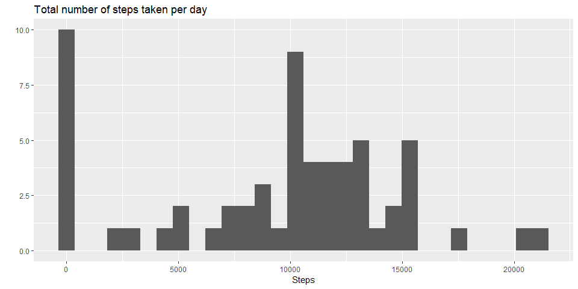
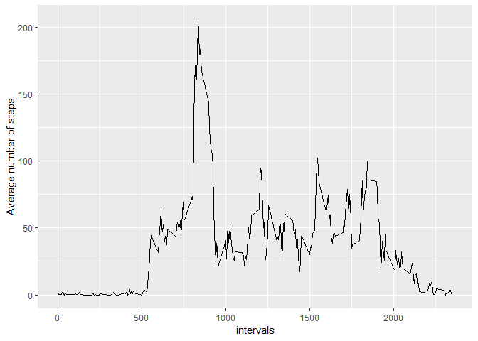
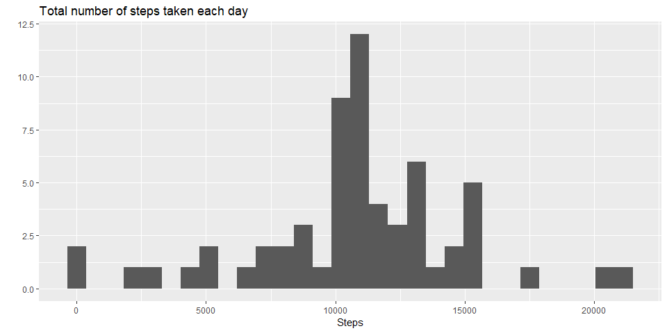
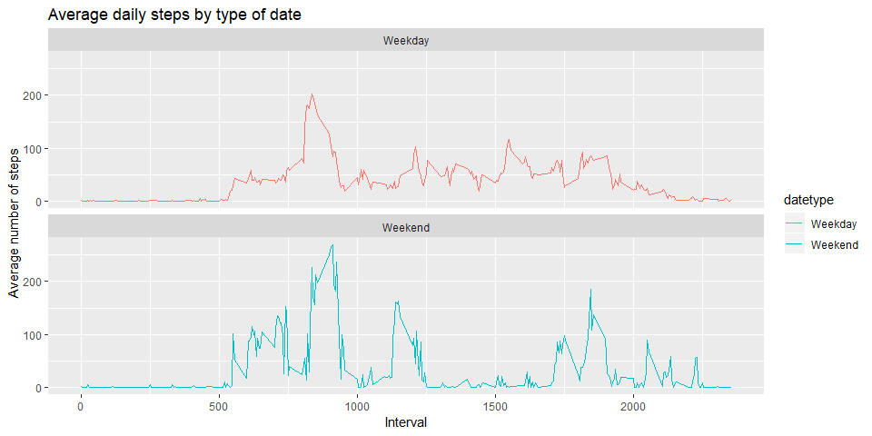

Reproducible Research Course Project 1
======================================

First we gonna loading and preprocessing the data

    library(ggplot2)
    library(readr)
    activity <- read_csv("activity.csv")

    ## Parsed with column specification:
    ## cols(
    ##   steps = col_double(),
    ##   date = col_date(format = ""),
    ##   interval = col_double()
    ## )

    activity$date <- as.POSIXct(activity$date, "%Y-%m-%d")
    weekday <- weekdays(activity$date)
    activity <- cbind(activity,weekday)

    summary(activity)

    ##      steps             date                        interval     
    ##  Min.   :  0.00   Min.   :2012-09-30 19:00:00   Min.   :   0.0  
    ##  1st Qu.:  0.00   1st Qu.:2012-10-15 19:00:00   1st Qu.: 588.8  
    ##  Median :  0.00   Median :2012-10-30 19:00:00   Median :1177.5  
    ##  Mean   : 37.38   Mean   :2012-10-30 19:00:00   Mean   :1177.5  
    ##  3rd Qu.: 12.00   3rd Qu.:2012-11-14 19:00:00   3rd Qu.:1766.2  
    ##  Max.   :806.00   Max.   :2012-11-29 19:00:00   Max.   :2355.0  
    ##  NA's   :2304                                                   
    ##       weekday    
    ##  domingo  :2592  
    ##  jueves   :2592  
    ##  lunes    :2592  
    ##  martes   :2592  
    ##  miércoles:2592  
    ##  sábado   :2304  
    ##  viernes  :2304

Then we gonna answer some questions about the data

1. What is mean total number of steps taken per day?
----------------------------------------------------

    steps <- with(activity, aggregate(steps, by = list(date), FUN = sum, na.rm = TRUE))
    names(steps) <- c("date", "steps")

    qplot(steps$steps,main = "Total number of steps taken per day", xlab = "Steps")

    ## `stat_bin()` using `bins = 30`. Pick better value with `binwidth`.

    mean(steps$steps)

    ## [1] 9354.23

    median(steps$steps)

    ## [1] 10395

So, how we can see the mean of the total steps taken per day is 9354.23

2. What is the average daily activity pattern?
----------------------------------------------

    average_daily_activity <- aggregate(activity$steps, by=list(activity$interval), FUN=mean, na.rm=TRUE)
    names(average_daily_activity) <- c("interval", "mean")
    qplot(average_daily_activity$interval, average_daily_activity$mean, geom = "line",ylab="Average number of steps", xlab="intervals")

    average_daily_activity[which.max(average_daily_activity$mean), ]$interval

    ## [1] 835

Here we can see the pattern of the average daily number of steps and the
max numer of steps ofthe intervals of 5 minutes.

3. Imputing missing values
--------------------------

There are some days where there are missing values. We are gonna to
calculate the total of this days.

    sum(is.na(activity$steps))

    ## [1] 2304

Then we construct a dataset with that values

    imputed_steps <- average_daily_activity$mean[match(activity$interval, average_daily_activity$interval)]
    activity_imputed <- transform(activity, steps = ifelse(is.na(activity$steps), yes = imputed_steps, no = activity$steps))
    total_steps_imputed <- aggregate(steps ~ date, activity_imputed, sum)
    names(total_steps_imputed) <- c("date", "daily_steps")

    qplot(total_steps_imputed$daily_steps,main = "Total number of steps taken each day", xlab = "Steps")

    ## `stat_bin()` using `bins = 30`. Pick better value with `binwidth`.

    mean(total_steps_imputed$daily_steps)

    ## [1] 10766.19

    median(total_steps_imputed$daily_steps)

    ## [1] 10766.19

The difference betwen the first values an the newest is very sgnificant
for the mean, but for the median is not very big because its sturdiness.

4. Are there differences in activity patterns between weekdays and weekends?
----------------------------------------------------------------------------

Creating a new factor variable in the dataset with two levels -
"weekday" and "weekend" indicating whether a given date is a weekday or
weekend day.

    activity$date <- as.Date(strptime(activity$date, format="%Y-%m-%d"))
    activity$datetype <- sapply(activity$date, function(x) {
            if (weekdays(x) == "sabado" | weekdays(x) =="domingo") 
                    {y <- "Weekend"} else 
                    {y <- "Weekday"}
                    y
            })

Making a panel plot containing a time series plot (i.e. type = "l") of
the 5-minute interval (x-axis) and the average number of steps taken,
averaged across all weekday days or weekend days (y-axis)

    activity_by_date <- aggregate(steps~interval + datetype, activity, mean, na.rm = TRUE)
    plot<- ggplot(activity_by_date, aes(x = interval , y = steps, color = datetype)) +
           geom_line() +
           labs(title = "Average daily steps by type of date", x = "Interval", y = "Average number of steps") +
           facet_wrap(.~datetype, ncol = 1, nrow=2)
    print(plot)

